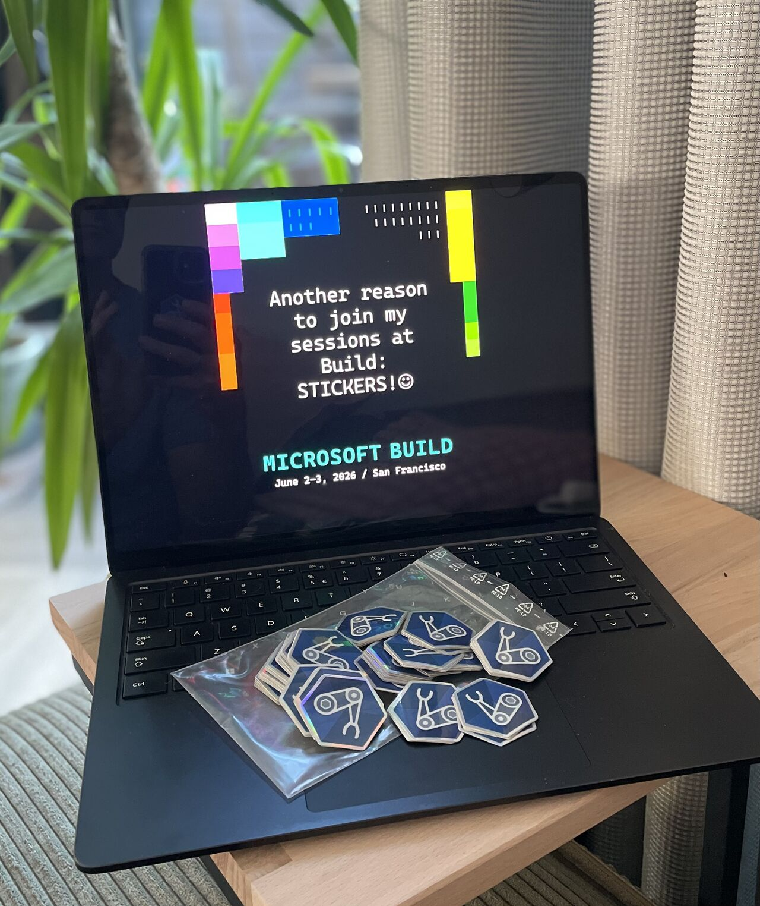

<a name="start-building"></a>
<br>
<p align="center">

</p>

# [Microsoft Build 2026](https://build.microsoft.com)

## 🔥 DEM363: From the Field: Accelerate Your Development for Azure Marketplace

### Session Description

Gain practical insights and proven strategies for your development journey for Azure Marketplace. Streamline your solutions' development, packaging, and deployment while ensuring compliance with Microsoft's requirements. Discover common pitfalls, best practices, and automation techniques to reduce time-to-market. Whether you're new to developing for the Azure Marketplace or looking to optimize your approach, this session delivers real-world guidance to help you develop and publish efficiently.

### 🚀 Getting started

To explore this demo at your own pace:
1. Declare your resources in a Bicep file
2. Transpile to an Azure Resource Manager template and validate with arm-ttk
3. Design the portal experience using createUiDefinition.json
4. Package the ARM template and createUiDefinition.json into a zip file
5. Upload to Azure Marketplace via Microsoft Partner Center and submit for validation
6. Deploy and verify your offer

### 🧠 Learning Outcomes

By the end of this demo, you will be able to:

- Declare and build Azure Marketplace offer templates using Bicep and Azure Resource Manager
- Design and configure the Azure Marketplace portal experience using createUiDefinition.json
- Validate, package, and submit an offer to Azure Marketplace via Microsoft Partner Center
- Apply lessons learned from real-world field experience on the development side of Azure Marketplace offers — including managed application access models, webhook integration, customer usage attribution, and ARM template constraints



### 💬 Keep Learning with Copilot

Try these prompts with GitHub Copilot to explore the topics from this demo. Open Copilot Chat in VS Code (`Ctrl+Alt+I` on Windows/Linux, `Cmd+Shift+I` on Mac), paste a prompt, and see what you learn. Try connecting the [Microsoft Learn MCP Server](#-microsoft-learn-mcp-server) for the latest official documentation.

Use these as a starting point — or write your own!

1. Understand the basics:

```
Explain how Azure Bicep works for defining Azure Marketplace managed application templates. What are the key constraints — like ARM template language version limitations — I should be aware of when authoring for Azure Marketplace?
```

2. Go deeper:

```
Using the Microsoft Learn MCP Server, find the latest documentation on createUiDefinition.json and explain how to map UI elements to ARM template parameters for an Azure Marketplace managed application offer.
```

3. Build something:

```
Help me create a basic Azure Marketplace managed application package — including a mainTemplate.bicep, compile it to mainTemplate.json, and a simple createUiDefinition.json — ready to upload to Microsoft Partner Center.
```

### 💻 Technologies Used

1. [Azure Bicep - Infra as Code](https://learn.microsoft.com/azure/azure-resource-manager/bicep/overview)
1. [Azure Resource Manager](https://learn.microsoft.com/azure/azure-resource-manager/templates/overview)
1. [Azure CLI](https://learn.microsoft.com/cli/azure/)
1. [arm-ttk (Azure Resource Manager Template Toolkit)](https://learn.microsoft.com/azure/azure-resource-manager/templates/test-toolkit)
1. [Azure Marketplace](https://learn.microsoft.com/partner-center/marketplace-offers/plan-azure-app-managed-app)

### 📚 Resources and Next Steps

| Resource | Description |
|:---------|:------------|
| [https://aka.ms/build26-next-steps](https://aka.ms/build26-next-steps) | Explore lab and session repos to further your learning from Microsoft Build |


### 🌟 Microsoft Learn MCP Server

The Microsoft Learn MCP Server gives your AI agent direct access to Microsoft's official documentation — grounded, up-to-date answers about the products and services covered in this session.

**VS Code** — One click installation: 

[](https://vscode.dev/redirect/mcp/install?name=microsoft-learn&config=%7B%22type%22%3A%22http%22%2C%22url%22%3A%22https%3A%2F%2Flearn.microsoft.com%2Fapi%2Fmcp%22%7D)


**GitHub Copilot CLI** — Run this to install the Learn MCP Server as a plugin:
```
/plugin install microsoftdocs/mcp
```

For more info, other clients, and to post questions, visit the [Learn MCP Server repo](https://aka.ms/learnmcp).

## Content Owners

<table>
<tr>
    <td align="center"><a href="http://github.com/fberson">
        <br />
        <sub><b>Freek Berson</b></sub></a><br />
            <a href="https://github.com/fberson" title="talk">📢</a>
    </td>
</tr></table>

## Contributing

This project welcomes contributions and suggestions.  Most contributions require you to agree to a
Contributor License Agreement (CLA) declaring that you have the right to, and actually do, grant us
the rights to use your contribution. For details, visit [Contributor License Agreements](https://cla.opensource.microsoft.com).

When you submit a pull request, a CLA bot will automatically determine whether you need to provide
a CLA and decorate the PR appropriately (e.g., status check, comment). Simply follow the instructions
provided by the bot. You will only need to do this once across all repos using our CLA.

This project has adopted the [Microsoft Open Source Code of Conduct](https://opensource.microsoft.com/codeofconduct/).
For more information see the [Code of Conduct FAQ](https://opensource.microsoft.com/codeofconduct/faq/) or
contact [opencode@microsoft.com](mailto:opencode@microsoft.com) with any additional questions or comments.

## Trademarks

This project may contain trademarks or logos for projects, products, or services. Authorized use of Microsoft
trademarks or logos is subject to and must follow
[Microsoft's Trademark & Brand Guidelines](https://www.microsoft.com/legal/intellectualproperty/trademarks/usage/general).
Use of Microsoft trademarks or logos in modified versions of this project must not cause confusion or imply Microsoft sponsorship.
Any use of third-party trademarks or logos are subject to those third-party's policies.
